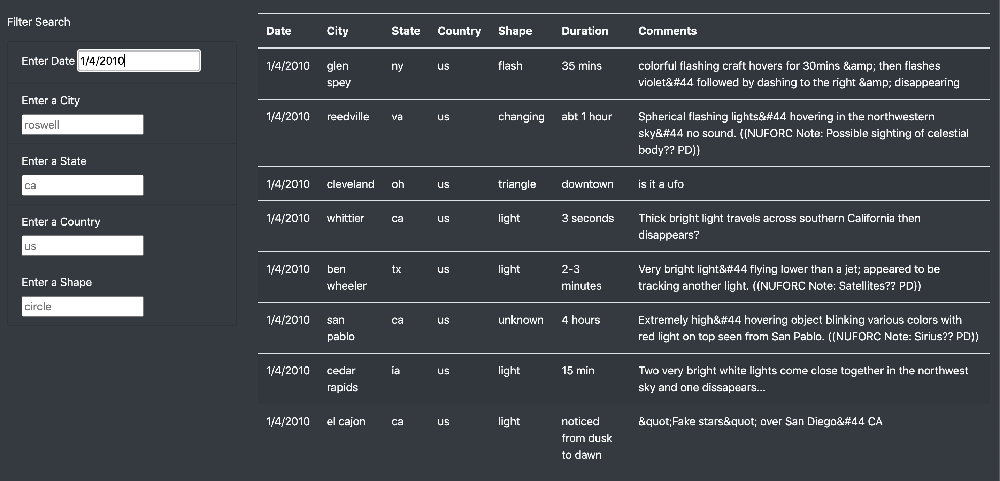
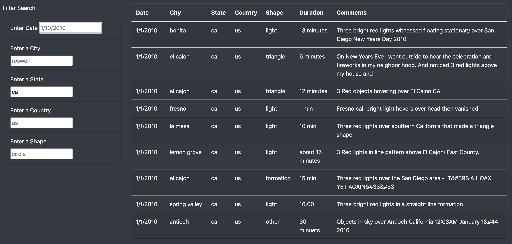

# UFOs

## Overview of Project
My client Dana has tasked me with building an interactive webpage that can be used to analyze UFO sightings.

The task required building a HTML table of data from a JavaScript array. The table needs to be filtered dynamically by reacting to user input.

The webpage is also customized using Bootstrap.

## Results
### How to use the webpage
1. The table located at the bottom of the webpage will contain all of the UFO sighting data when you first load the page:

2. If you type into any of the text boxes to the left of the table and then click Enter the table will only display sightings that meet the criteria:

3. You can further filter the data by typing into the other text boxes and clicking Enter. Only sightings that meet all of the entered criteria will be displayed:

4. If you delete all of the text in any of the boxes and click Enter, that filter will be removed:

## Summary
### Drawbacks
Currently the filters are very sensitive and must match the data exactly.

#### Examples:
1. The date must be in the correct format and not include any leading 0s:

2. The city, state, country, and shape filters must be lower case:

### Further Improvements
1. The datetime filter could be an intuitive 'Date Picker'
2. The state filter could be a dropdown selector
3. The other filters should not be case sensitive
